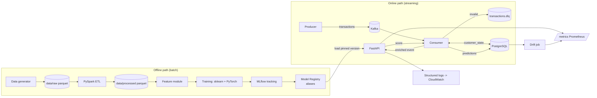
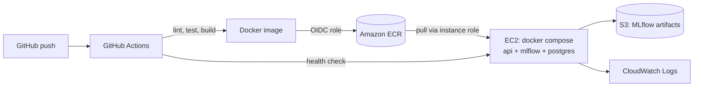

# ARCHITECTURE.md

**Status:** Approved target architecture; defaults are locked (see TASKS.md, "Locked decisions"). This document describes the intended system, not the current implementation. For delivered capabilities and verification gaps, see [TASKS.md](TASKS.md).

## 1. Purpose and scope

A single coherent system for **real-time transaction anomaly detection**: simulated transactions stream through Kafka, are validated, enriched and scored by a model served from an MLflow registry, while a separate offline path (Spark ETL, training, evaluation) produces and registers those models.

In scope: everything in the master prompt. Explicitly **local-only** (documented integration boundary, not deployed to AWS): Kafka and Spark. Deployed to AWS: the API (plus MLflow and Postgres, see open question Q1).

Design principle: **the online path never depends on training.** The API only needs a registered model version and (optionally) request-supplied context. Retraining can be down and scoring continues.

## 2. System overview



## 3. Services and boundaries

| Service | Responsibility | Owns | Depends on | Must NOT |
|---|---|---|---|---|
| **generator** (CLI) | Reproducible synthetic labelled data; also drives the producer | `data/raw/*.parquet` | nothing | touch Kafka/DB directly |
| **producer** | Publish unlabelled events to `transactions` | nothing | Kafka, generator library | emit the label field |
| **consumer** | Validate, dead-letter, enrich from `customer_state`, call API, persist results | `raw_transactions`, `customer_state`, `predictions`, `dlq_events` tables | Kafka, Postgres, API | load a model itself |
| **etl** (PySpark) | Validate, clean, aggregate historical data into training-ready parquet | `data/processed/` | raw parquet (or Postgres export) | compute features differently from the shared feature module |
| **features** (library) | Pure functions defining every feature; single source of truth for train and serve | nothing | pandas/numpy | do I/O |
| **training** | Train, evaluate, log, register | MLflow runs, registered versions | processed data, MLflow | write to the serving path |
| **mlflow** | Tracking + registry | experiments, model versions, artifacts | Postgres (backend), volume/S3 (artifacts) | |
| **api** | Stateless scoring, health, metrics, model info, A/B routing | nothing persistent | MLflow registry (startup/refresh) | read Kafka or Postgres, call training |
| **monitoring** | Metrics, drift detection | drift reports table | Postgres, API metrics | |

Key boundary decision: **the API is stateless.** Customer history lookups happen in the consumer, which sends an enriched payload. This keeps API latency predictable, lets it scale horizontally, and means a database outage does not take down `/predict` for direct callers.

## 4. Repository structure (with justified changes)

```
real-time-ml-platform/
├── README.md  ARCHITECTURE.md  DECISIONS.md  TASKS.md  CONTRIBUTING.md  LICENSE
├── pyproject.toml            # installable package `rtml`, tool config (ruff, pytest)
├── .env.example  .gitignore  .dockerignore
├── docker-compose.yml
├── src/rtml/
│   ├── common/               # config (pydantic-settings), logging, ids
│   ├── data/                 # generator, schemas, validation
│   ├── streaming/            # producer.py, consumer.py, dlq.py
│   ├── etl/                  # spark jobs, transformations
│   ├── features/             # engineering.py (pure), validation.py
│   ├── training/             # train_sklearn.py, train_torch.py, evaluate.py, registry.py
│   ├── api/                  # main.py, schemas.py, routes/, dependencies.py, ab.py
│   └── monitoring/           # metrics.py, drift.py
├── sql/                      # numbered migrations
├── configs/                  # training/*.yaml, ab_experiment.yaml
├── data/sample/              # small committed sample; raw/ and processed/ are gitignored
├── tests/{unit,integration,api}/
├── infrastructure/
│   ├── docker/               # one Dockerfile per image
│   ├── aws/                  # IAM policy JSON, user-data, setup docs
│   ├── monitoring/           # prometheus.yml
│   └── scripts/              # deploy.sh, rollback.sh, cleanup.sh (run intentionally)
├── requirements/             # base, api, etl, training, dev
└── .github/workflows/{ci.yml,deploy.yml}
```

Changes from the master prompt and why:

- **`src/rtml/` package instead of top-level service folders.** `features/` must be imported by ETL, training *and* the API. Separate top-level folders force `sys.path` hacks or copy-paste, which is exactly how train/serve skew starts.
- **Dropped `models/artifacts/`.** The registry is the source of truth; a local artifacts folder invites "load whatever file is lying around".
- **Dropped the top-level `mlflow/` folder.** It would hold only a Dockerfile, which belongs in `infrastructure/docker/`.
- **Added `sql/`** for versioned schema migrations, and **`configs/`** for training and A/B config.
- Per-service requirements files keep the API image small (no Spark, no PyTorch by default).

## 5. Data contracts

### 5.1 Transaction event (Kafka topic `transactions`, JSON)

| Field | Type | Required | Notes |
|---|---|---|---|
| transaction_id | string (UUID4) | yes | idempotency key |
| timestamp | string (ISO-8601 UTC) | yes | event time; must not be in the future beyond tolerance |
| customer_id | string | yes | |
| amount | float > 0 | yes | single currency |
| merchant_category | enum | yes | e.g. grocery, travel, electronics, dining, utilities, gambling, other |
| transaction_type | enum | yes | purchase, withdrawal, transfer, refund |
| payment_method | enum | yes | card, bank_transfer, wallet |
| customer_age | int 18-100 | no | missing allowed |
| account_age_days | int >= 0 | yes | |
| transaction_count_24h | int >= 0 | yes | upstream-supplied aggregate (assumption A1) |
| average_transaction_amount | float >= 0 | no | upstream-supplied customer average, point-in-time (A1) |
| location | string (country/city code) | no | missing allowed |
| device_type | enum | no | mobile, desktop, pos, atm; missing allowed |
| previous_failed_transactions | int >= 0 | yes | failures in trailing window (A1) |

**The label (`is_anomaly`) exists only in training data.** The producer strips it; the event schema rejects it. Ground truth for monitoring is simulated on a separate delayed channel (topic `transaction-labels`, Phase 10), never in the event.

**A1:** the spec lists `transaction_count_24h` and `average_transaction_amount` as event fields, so we treat them as computed upstream, point-in-time. The generator must compute them without looking at future rows.

### 5.2 Prediction request/response (API)

Request = event fields (no label) + optional **context** supplied by the consumer: `previous_location`, `previous_device_type`, `seconds_since_last_transaction`, `customer_amount_std`. Missing context is treated as missing values (imputed), not as an error, and the response flags `context_complete: false`.

Response: `transaction_id, prediction, risk_score, threshold, model_name, model_version, latency_ms, request_id, ab_group` (the group is only present when an experiment is active).

### 5.3 PostgreSQL tables

| Table | Key | Purpose |
|---|---|---|
| raw_transactions | transaction_id | validated events as received |
| dlq_events | id (serial) | malformed payload, error reason, topic/partition/offset, received_at |
| customer_state | customer_id | last_location, last_device_type, last_ts, running mean/std of amount (Welford), updated by consumer |
| predictions | transaction_id | score, label, model_name/version, latency, request_id, scored_at |
| ground_truth | transaction_id | delayed label, for performance monitoring |
| drift_reports | id | feature, metric, value, window, computed_at |

MLflow uses its own schema (separate database) in the same Postgres instance.

## 6. Features and leakage rules

Every feature is defined once in `rtml.features.engineering` as a pure function of (event, point-in-time context).

| Feature | Source | Available at inference? | Needs history? |
|---|---|---|---|
| amount, log_amount, hour_of_day, day_of_week, is_weekend | event | yes | no |
| merchant_category, transaction_type, payment_method, device_type (encoded) | event | yes | no |
| customer_age, account_age_days, previous_failed_transactions | event | yes | no |
| transaction_count_24h, transactions_last_hour | event / state | yes | upstream aggregate |
| amount_vs_customer_average | amount / average_transaction_amount | yes | upstream aggregate |
| amount_zscore | (amount - running mean) / running std | yes | **customer_state** |
| location_change_indicator, device_change_indicator | event vs customer_state | yes | **customer_state** |
| transaction_velocity (1 / seconds since last) | event vs customer_state | yes | **customer_state** |
| failed_transaction_ratio | failures / count_24h | yes | upstream aggregate |
| merchant_frequency | customer's share of this category | yes | **customer_state** (point-in-time counts) |

**Forbidden (future information or label-derived):** `is_anomaly` or anything derived from it; chargeback or investigation outcomes; global statistics (dataset-wide mean/std, category frequencies) computed over train+test; any aggregate including the current or later rows when computing "prior" state; target encoding fitted outside the training fold.

Leakage controls:

1. **Time-based split** (train earliest, validation next, test latest), not random.
2. Preprocessors (imputer, scaler, encoder) are fitted on train only and live inside the logged sklearn `Pipeline`, so serving uses identical preprocessing.
3. Point-in-time state is computed by iterating events in time order per customer, with state updated *after* featurising each event.
4. A **parity test** replays a sample through the offline path and the online path (consumer enrichment + API featurisation) and asserts identical feature vectors.

## 7. ML approach

- Baseline: Logistic Regression (`class_weight=balanced`). Stronger: Random Forest, with gradient boosting considered only if justified by results.
- PyTorch: small MLP (embeddings for categoricals plus numeric block) with real training/validation loops, early stopping, checkpointing, GPU detection with CPU fallback, logged to MLflow.
- Imbalance handling: class weights / weighted loss; no SMOTE by default (documented why).
- Metrics: precision, recall, F1, ROC-AUC, PR-AUC, confusion matrix, p50/p95 single-row inference latency. PR-AUC is primary. Accuracy is reported only to demonstrate that it misleads (a model predicting "normal" always scores about 98% at a 2% anomaly rate).
- Decision threshold is chosen on **validation** (e.g. maximise F-beta or hit a target recall), stored with the model version, and applied by the API. Test set is touched once per candidate.
- Synthetic data must be statistically meaningful and *not perfectly separable*: anomaly archetypes (amount spike versus customer norm, velocity burst, new device plus new location, repeated failures, small "card-testing" amounts, odd hours), overlapping distributions, controlled label noise, missing-value injection, and named drift scenarios (amount inflation, category-mix shift, new anomaly pattern). Full generation process documented in Phase 1.

## 8. Model lifecycle (MLflow)

MLflow's classic "stages" are deprecated in favour of **aliases**, so the spec's lifecycle maps to:

```
training run logged        -> candidate    (alias `candidate` on the new version)
evaluation gates pass      -> validated    (alias `validated`)
promoted by explicit command -> production (alias `production`)
```

- Registered model name: `transaction-anomaly`; the PyTorch experiment registers under `transaction-anomaly-mlp` (not served by default).
- Promotion is a script (`python -m rtml.training.registry promote --version N --to production`) that checks gates (PR-AUC floor, no regression versus current production, latency budget) and records who/when as version tags. Rollback = move the `production` alias to the previous version.
- The API resolves `models:/transaction-anomaly@production` to a **concrete version number at startup**, loads that version, and reports it in every response and `/model/info`. It never silently hot-swaps; refresh is an explicit admin action or restart.
- Logged per run: params, metrics, model, dataset version (content hash + generator seed/config), git commit, timestamp.

## 9. API design

`GET /health` (process alive), `GET /ready` (model loaded; reports version), `GET /metrics` (Prometheus), `POST /predict`, `POST /predict/batch` (bounded size), `GET /model/info`.

- Pydantic v2 validation, structured error body `{error: {code, message, request_id, details}}`, `X-Request-ID` honoured or generated.
- If no model is loaded: `/ready` returns 503 and `/predict` returns 503 with a structured error (tested).
- Logs are JSON with request_id, model_version, latency, prediction; **no raw PII-like payload** (no customer_id in plain text; hashed or omitted).
- A/B routing (Phase 11): deterministic hash of `customer_id` to arm (stable assignment), configurable split, both models resident in memory.

## 10. Deployment architecture



- Auth: GitHub OIDC to an IAM role for pushing to ECR (no stored keys); EC2 instance profile for ECR pull, S3 and CloudWatch. No long-lived AWS credentials anywhere.
- Deploy: SSH or SSM command pulls the new image tag, restarts the container, polls `/ready`, rolls back to the previous tag on failure.
- Nothing is provisioned automatically; `infrastructure/scripts/` contains scripts the developer runs deliberately, plus a cleanup script and cost notes.

## 11. Monitoring

- **Operational ("is the service working?")**: request count, latency histogram, error count by code, process CPU/memory, model-loaded gauge, consumer lag (consumer exports it).
- **ML ("is the model still behaving?")**: prediction rate, risk-score histogram, per-feature drift (PSI and KS test versus a training reference snapshot stored with the model), performance on delayed ground truth when available.
- Local: Prometheus scrape config included; Grafana optional and deferred unless time allows. AWS: CloudWatch Logs; metrics scraped locally or via the `/metrics` endpoint.

## 12. Failure handling

| Failure | Behaviour |
|---|---|
| Malformed / schema-invalid message | Written to `transactions.dlq` and `dlq_events` with reason and offset; offset committed; counter incremented |
| API unavailable or slow | Consumer retries with exponential backoff and jitter; offset **not** committed until persisted; after max retries the event goes to DLQ with reason `scoring_failed` |
| Postgres down | Consumer pauses, retries, exposes unhealthy status; no offset commit; API unaffected |
| Kafka down | Producer/consumer reconnect with backoff; clear logs; API unaffected |
| Model missing/corrupt | API starts not-ready; `/predict` returns structured 503; deployment health check fails and rolls back |
| Duplicate delivery | At-least-once delivery; writes are idempotent upserts on `transaction_id` |
| Graceful shutdown | SIGTERM: stop polling, finish in-flight batch, commit offsets, close connections |

## 13. Technology choices (summary; detail in DECISIONS.md)

Python 3.11, `confluent-kafka`, Kafka in KRaft mode (no ZooKeeper), PySpark 3.5 (local mode), PostgreSQL 16, scikit-learn, PyTorch (CPU build), MLflow 2.x, FastAPI/Pydantic v2/Uvicorn, `prometheus-client`, `structlog`, pytest, ruff, Docker Compose, GitHub Actions, AWS (EC2, ECR, S3, IAM, CloudWatch).

## 14. Risks

| # | Risk | Likelihood | Mitigation |
|---|---|---|---|
| R1 | **Train/serve skew** between offline and online features | High | Single feature module; parity test in Phase 3/5 |
| R2 | **Spark is oversized** for 100k rows and could look like résumé padding | High | Use Spark only for what it is good at (validation, windowed aggregates, partitioned parquet), document scale justification honestly, keep Pandas for modelling; see Q2 |
| R3 | Docker integration left to Phase 6 causes late surprises | Medium | Add Kafka/Postgres/MLflow compose services incrementally from Phases 2 to 4 |
| R4 | Synthetic data too easy (near-perfect scores) or label noise untuned | Medium | Overlap and noise parameters, report realistic metrics, ablation, document limits |
| R5 | Local resource use (Kafka + Spark JVMs + Postgres) on a laptop | Medium | Spark runs on demand, not as a service; KRaft Kafka single broker; resource limits in compose |
| R6 | MLflow registry API changes (stages -> aliases) | Medium | Pin MLflow version; aliases only |
| R7 | Free-tier EC2 too small for api + mlflow + postgres | Medium | Size guidance in docs; start with t3.small; alternative in Q1 |
| R8 | PyTorch image bloat | Medium | CPU wheels; torch kept out of API image unless serving the MLP |
| R9 | Scope creep (A/B, drift, monitoring all at once) | High | Phases 10/11 are explicitly cuttable; Rule 4 applies |
| R10 | Overclaiming (e.g. significance in simulated A/B) | Medium | Document limits; compute proper tests or make no claim |

## 15. Assumptions and out of scope

- Single currency, single region, synthetic data only; no real PII.
- Kafka and Spark are not deployed to AWS; the integration boundary (raw events in, parquet out, API contract) is documented.
- No Kubernetes, Terraform, Airflow, Redis, SageMaker, Lambda, ECS (Rule 3). Revisit only with a stated reason.
- Latency targets (e.g. p95 under 50 ms single predict on CPU) are goals to measure in Phase 12, not claims.

## 16. Open questions for approval

Resolved. See "Locked decisions" at the end of TASKS.md.
